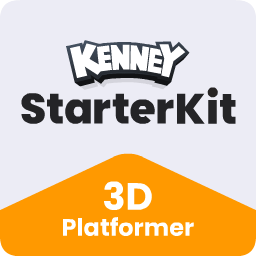
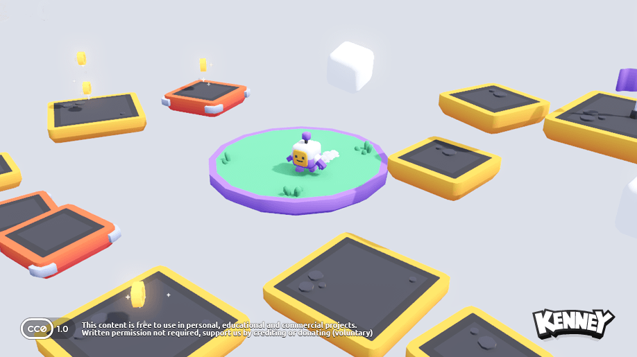

<p align="center"></p>

# SwiftGodot 3D Platformer Starter Kit

This repository is a modified version of the [3D Platformer Starter Kit](https://github.com/KenneyNL/Starter-Kit-3D-Platformer) originally created by Kenney, adapted to showcase the usage of [SwiftGodot](https://github.com/migueldeicaza/SwiftGodot) for developing in Godot.

## Screenshot
 
<p align="center"></p>

## Goal

The primary aim of this project is to provide a complete Godot project written entirely in Swift using SwiftGodot that other gamedevs can use to learn from.

## Getting Started

## Getting Started

Follow the steps below to build and run the project.

### Requirements

* macOS
* Intel Mac (`x86_64`)
* Swift 6.2 or later
* Godot 4.6.x
* SwiftGodot 0.75.0

### 1. Download the SwiftGodot 0.75.0 SDK

This project requires the **SwiftGodot 0.75.0 macOS x86_64 SDK**.

Download it from:

**SwiftGodot 0.75.0 macOS x86_64 SDK**
https://github.com/crimson-aril/SwiftGodot-0.75.0-macOS-x86_64-SDK

Extract the SDK to a convenient location, for example:

```text
/Users/<your-username>/SwiftGodotSDK
```

For example:

```text
/Users/jhon/SwiftGodotSDK
```

> **Important:** The path above is only an example. Use the actual path where you extracted the SDK.

### 2. Configure SwiftGodot in `Package.swift`

Open:

```text
source/Package.swift
```

Configure the SwiftGodot package dependency to point to the SDK you downloaded.

For example:

```swift
.package(
    path: "/Users/<your-username>/SwiftGodotSDK"
)
```

Then make sure the `Platformer3D` target uses the `SwiftGodotSDK` product:

```swift
.product(
    name: "SwiftGodotSDK",
    package: "SwiftGodot-0.75.0-Distribution"
)
```

> **Note:** The package name must match the package name defined by the SDK you downloaded. If the SDK uses a different package name, use that exact name in `package:`.

### 3. Build the Swift Extension

Enter the Swift package directory:

```bash
cd source
```

Build the project in debug mode:

```bash
swift build -c debug
```

The resulting dynamic library will be located at:

```text
source/.build/x86_64-apple-macosx/debug/libPlatformer3D.dylib
```

### 4. Copy the Extension to `bin`

From the `source` directory, copy the generated library into the project's `bin` directory:

```bash
cp .build/x86_64-apple-macosx/debug/libPlatformer3D.dylib ../bin/
```

The project also requires the corresponding **SwiftGodot framework** to be available in the `bin` directory.

Your project should have a structure similar to:

```text
Starter-Kit-3D-Platformer-Swift/
├── bin/
│   ├── libPlatformer3D.dylib
│   └── SwiftGodot.framework/
├── scenes/
├── objects/
├── source/
│   ├── Package.swift
│   └── Sources/
└── project.godot
```

### 5. Open the Project in Godot

Open the project directory in Godot:

```text
Starter-Kit-3D-Platformer-Swift/
```

The main scene is:

```text
scenes/main.tscn
```

Press **F6** to run the current scene, or **F5** to run the main project scene.

## Controls

| Input            | Action        |
| ---------------- | ------------- |
| `W`              | Move forward  |
| `A`              | Move left     |
| `S`              | Move backward |
| `D`              | Move right    |
| `Space`          | Jump          |
| Trackpad / Mouse | Rotate camera |
| `↑`              | Camera up     |
| `↓`              | Camera down   |
| `←`              | Camera left   |
| `→`              | Camera right  |
| `+`              | Zoom in       |
| `−`              | Zoom out      |

## Trackpad Support

The third-person camera supports trackpad and mouse movement through Godot's `InputEventMouseMotion` events.

SwiftGodot 0.75.0 exposes the relative pointer movement through:

```swift
motion.relative
```

The camera uses this relative movement to control horizontal and vertical camera rotation, allowing compatible trackpads and mice to control the camera without relying on Godot's mouse-capture API.

## Ready to Go

Once the SwiftGodot SDK is configured, the Swift extension is built and copied to `bin`, and the project is opened in Godot, you are ready to explore the code and run the game!


## Credits

- Original 3D Platformer Starter Kit by Kenney - [KenneyNL/Starter-Kit-3D-Platformer](https://github.com/KenneyNL/Starter-Kit-3D-Platformer)
- SwiftGodot by Miguel de Icaza - [migueldeicaza/SwiftGodot](https://github.com/migueldeicaza/SwiftGodot)

> ### License
> 
> MIT License
> 
> Copyright (c) 2023 Kenney
> 
> Permission is hereby granted, free of charge, to any person obtaining a copy of this software and associated documentation files (the "Software"), to deal in the Software without restriction, including without limitation the rights to use, copy, modify, merge, publish, distribute, sublicense, and/or sell copies of the Software, and to permit persons to whom the Software is furnished to do so, subject to the following conditions:
> 
> The above copyright notice and this permission notice shall be included in all copies or substantial portions of the Software.
> 
> THE SOFTWARE IS PROVIDED "AS IS", WITHOUT WARRANTY OF ANY KIND, EXPRESS OR IMPLIED, INCLUDING BUT NOT LIMITED TO THE WARRANTIES OF MERCHANTABILITY, FITNESS FOR A PARTICULAR PURPOSE AND NONINFRINGEMENT. IN NO EVENT SHALL THE AUTHORS OR COPYRIGHT HOLDERS BE LIABLE FOR ANY CLAIM, DAMAGES OR OTHER LIABILITY, WHETHER IN AN ACTION OF CONTRACT, TORT OR OTHERWISE, ARISING FROM, OUT OF OR IN CONNECTION WITH THE SOFTWARE OR THE USE OR OTHER DEALINGS IN THE SOFTWARE.
> 
> Assets included in this package (2D sprites, 3D models and sound effects) are [CC0 licensed](https://creativecommons.org/publicdomain/zero/1.0/)
>
